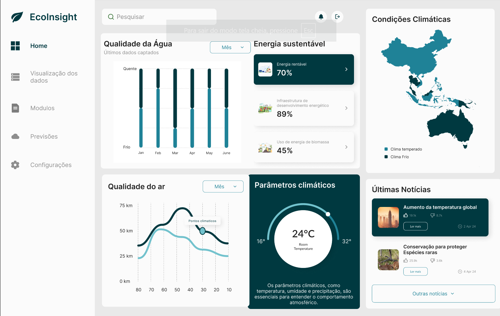

# EcoInsight Dashboard 🌱

**Descrição:**  
O **EcoInsight** é um painel de controle intuitivo para monitoramento ambiental, projetado para fornecer dados importantes sobre qualidade da água, qualidade do ar, energia sustentável, parâmetros climáticos e condições climáticas. Este dashboard é uma ferramenta essencial para profissionais e entusiastas ambientais que desejam acessar informações precisas e tomar decisões informadas.

---

## 🔗 Link para o Protótipo no Figma  
Acesse o protótipo completo do projeto no Figma clicando [aqui](https://www.figma.com/proto/ejtQsTTGmA40AhDRGnfViH/Dashboard-Meio-ambiente---(EcoInsight))?node-id=1603-397&node-type=canvas&t=4VAbIOSKD2npK1CM-0&scaling=contain&content-scaling=fixed&page-id=0%3A1).

---

## 📸 Captura de Tela do Protótipo  
Abaixo está uma prévia do design do dashboard:  

---

## 🛠️ Funcionalidades  

### 1. **Qualidade da Água**  
- Dados apresentados em gráficos mensais sobre a temperatura e condições da água.

### 2. **Energia Sustentável**  
- Informações sobre o uso de energia rentável, infraestrutura energética e energia de biomassa, com porcentagens detalhadas.

### 3. **Condições Climáticas**  
- Mapa interativo exibindo diferentes zonas climáticas (temperado e frio).

### 4. **Qualidade do Ar**  
- Gráficos detalhados sobre qualidade do ar em diferentes altitudes (0 km, 25 km, etc.).

### 5. **Parâmetros Climáticos**  
- Informações em tempo real sobre temperatura, umidade e outros parâmetros essenciais.

### 6. **Últimas Notícias**  
- Área dedicada às principais notícias ambientais, como aquecimento global e conservação de espécies.

---

## 🚀 Tecnologias Utilizadas  
- **Design:** Figma

---

## 🌍 Objetivo do Projeto  
- **Monitoramento em Tempo Real:** Proporcionar informações atualizadas para o monitoramento ambiental.  
- **Educação e Consciência:** Aumentar a conscientização sobre mudanças climáticas e sustentabilidade.  
- **Apoio à Decisão:** Ferramenta para ajudar profissionais em decisões estratégicas.

---

## 👩‍💻 Como Contribuir  
1. Faça um fork deste repositório.  
2. Crie uma branch para a sua feature: `git checkout -b minha-feature`.  
3. Faça o commit das suas alterações: `git commit -m 'Minha nova feature'`.  
4. Envie para a branch principal: `git push origin minha-feature`.  

---

> Desenvolvido alinhado com o objetivo 11 das ODS (cidades e comunidades sustentáveis).
